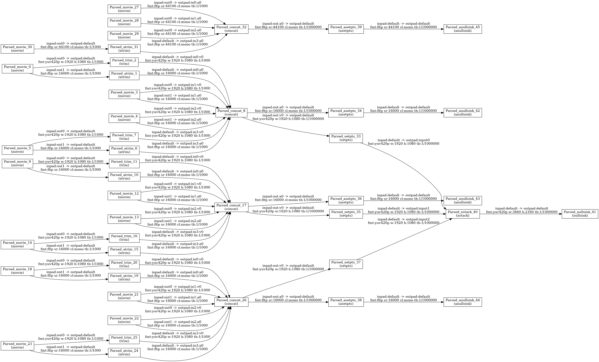

### Beholder Device
This project provides software for recording multiple streams of video and audio to use in observational social science research.

It allows one to connect to RTSP and USB cameras/microphones, detection motion in video frames, automatically upload these videos to a cloud storage service, and composite/synchronize multiple streams into a single video.

Currently it is compatible with Raspberry Pi 3/4 and Le Potato computer boards.

### Synchronization

To synchronize video you can run the following command

```bash
python sync.py sync --target <path-to-your-main-recording> --directory <path-to-all-your-recordings> --output test.mp4 --after 200
```

```bash
tree <path-to-all-your-recordings>
```

```bash
<path-to-all-your-recordings>/2022-09-22
├── 00
│   ├── 2022-09-22T00-59-31.2022-09-22T00-00-47.000000001.mic.mka
│   ├── 2022-09-22T00-59-31.2022-09-22T00-00-48.000000001.rtsp_3.mkv
│   ├── 2022-09-22T00-59-31.2022-09-22T00-00-49.000000001.rtsp_2.mkv
│   ├── 2022-09-22T00-59-31.2022-09-22T00-00-50.000000001.rtsp_1.mkv
│   ├── 2022-09-22T00-59-31.2022-09-22T00-01-46.000000002.rtsp_1.mkv
│   ├── 2022-09-22T00-59-31.2022-09-22T00-01-47.000000002.mic.mka
│   ├── 2022-09-22T00-59-31.2022-09-22T00-01-47.000000002.rtsp_3.mkv
│   ├── 2022-09-22T00-59-31.2022-09-22T00-01-49.000000002.rtsp_2.mkv
│   ├── 2022-09-22T00-59-31.2022-09-22T00-02-46.000000003.rtsp_1.mkv
```

where file names follow this convention

```
<datetime-recording-batch-started>.<datetime-recording-of-clip-started>.<clip-number>.<device-name>.mkv
```

While recording, a stream of video may be trimmed into more manageably sized clips.

To visualize the filter graph used to composite synchronized video streams, you can run the following command:

```bash
python sync.py sync-graph --target <path-to-your-main-recording> --directory <path-to-all-your-recordings> --output test.mp4 --after 200
```


